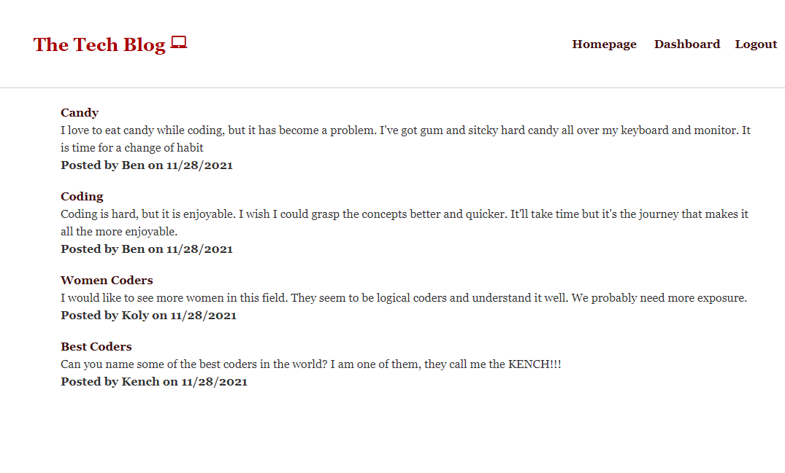

# Tech-Blog

  ## Table of Contents
  * [Description](#Description)
  * [Installation](#Installation-Instructions)
  * [Usage Instructions](#Usage-Instructions)
  
  * [Contributing Members](#Contributing-Members)
  * [Testing](#Testing)    
  * [Questions/Inquiries](#Questions/Inquiries)

  ## Built with
  JavaScript, css, bcrypt, connect-session-sequelize, dotenv, express, express-handlebars, express-session, mysql2, sequelize

  ## Description
  The Tech Blog is a blogsite for coders and tech people to come and post about, well, tech and code. You can create a user and use that to post what you like and comment on others posts. 

  ## Installation Instructions 
  N/A

  ## Usage Instructions
  Click on login to login if you already have an account, or signup yourself using an email after you've clicked on login. Once you're in your account, click on dashboard to make posts or go to the homepage to comment on what others have posted about.

  ## Contributing Members
  Ben Vue

  ## Testing 
   N/A

  ## Preview of app final product
  

  ### GitHub Profile
  [benyvue](http://github.com/benyvue)

  ### Email
  Please reach me at the provided email with any questions. bvue012@gmail.com
  
